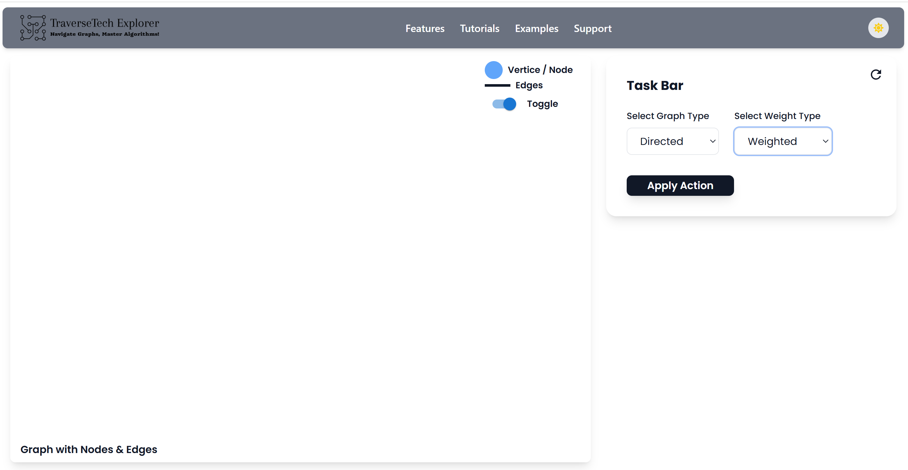
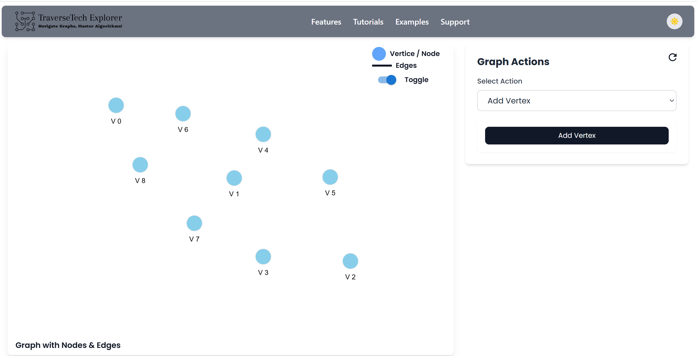
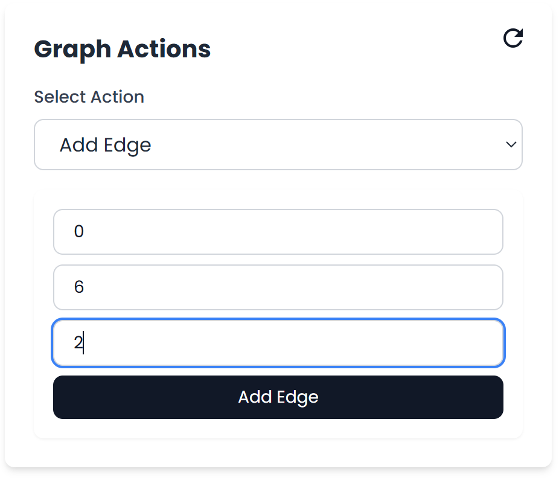
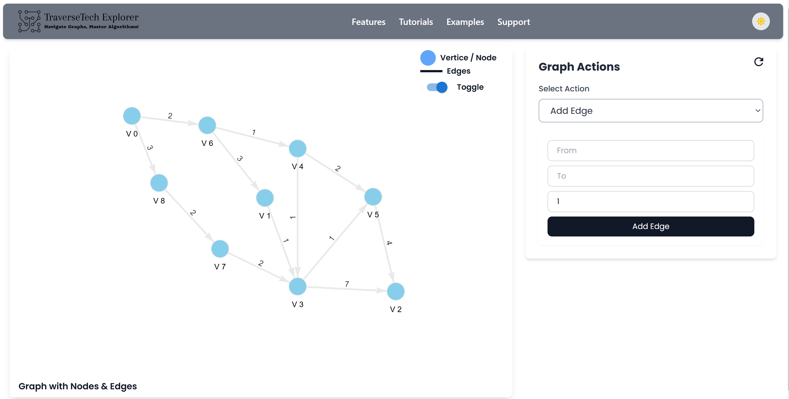
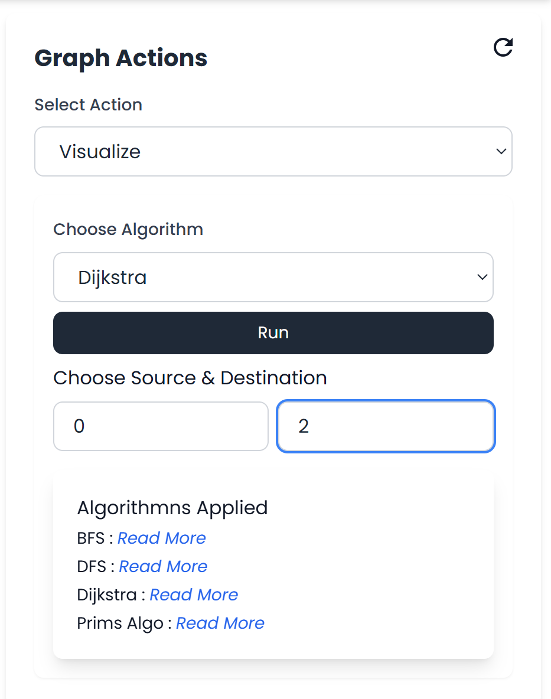
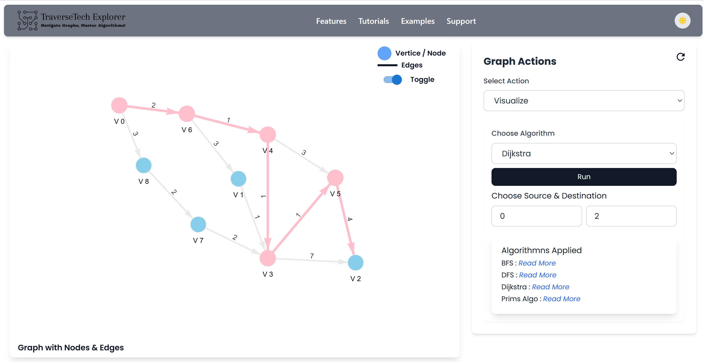

# 🚀 Traverse Tech Explorer

**Traverse Tech Explorer** is a dynamic and interactive web platform that allows users to **create, visualize, and run graph algorithms** in real time. Built for learners, educators, and engineers, this tool bridges the gap between theory and application in graph data structures using step-by-step animations and an intuitive interface.

---

## 📌 Table of Contents

- [🧠 Overview](#-overview)
- [💻 Tech Stack](#-tech-stack)
- [✨ Key Features](#-key-features)
- [🖼️ Screenshots](#-screenshots)
- [⚙️ Setup & Installation](#-setup--installation)
- [📚 How to Use](#-how-to-use)
- [🛠️ Future Enhancements](#-future-enhancements)
- [👨‍💻 Authors](#-authors)
- [📝 License](#-license)

---

## 🧠 Overview

> A project developed for minor submission under the guidance of **Dr. Nitika Nigam**, this tool provides an educational interface for visualizing graph traversal algorithms such as **BFS**, **DFS**, and **Dijkstra's Algorithm**, allowing users to customize their own graphs.

Use cases:
- Classroom demonstrations
- Personal learning
- Exploratory testing of pathfinding algorithms
- Concept reinforcement

---

## 💻 Tech Stack

| Layer       | Technology                          |
|-------------|--------------------------------------|
| Frontend    | HTML, CSS, React.js                  |
| Backend     | Java (for algorithm processing, optional storage) |
| Visualization | HTML5 Canvas, D3.js or Cytoscape.js |
| Protocols   | HTTPS (secured), optional WebSockets |

---

## ✨ Key Features

- 📌 **Interactive Graph Builder** – Drag & drop vertices and draw edges (directed/undirected, weighted/unweighted).
- 🧠 **Algorithm Runner** – Visualize algorithms like BFS, DFS, and Dijkstra on custom graphs.
- 🪄 **Step-by-Step Animation** – Follow the algorithm execution node-by-node.
- 📈 **Performance Insights** – View path length, nodes visited, and time complexity feedback.
- 📷 **Snapshot Feature** – Export graph images or results.
- 🌐 **Responsive UI** – Compatible across desktops and tablets.

---

## 🖼️ Screenshots


### 1️⃣ This is how the website looks like:


### 2️⃣ Adding Vertices:


### 3️⃣ Adding Edges:


### 4️⃣ Customized Graph Created by User:


### 5️⃣ Applying Dijkstra’s Algorithm:


### 6️⃣ Shortest Path Result:


---

## ⚙️ Setup & Installation

```bash
# Clone the repository
git clone https://github.com/your-username/traverse-tech-explorer.git
cd traverse-tech-explorer

# Install frontend dependencies
cd frontend
npm install

# (Optional) Run backend server
cd ../backend
javac Main.java
java Main

# Start the frontend
cd ../frontend
npm start
